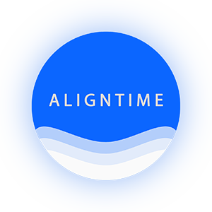

# Aligntime
AlignTime App product vision

##### Target group
Users of Invisalign Braces system.
##### Goal
To track wear time effectively and to get reminders, that help users to stay on track, while wearing their Invisalign
##### Needs 
A mobile app that is easy and efficient in order to track Invisalign wear time, progress and Orthodontist appointments.
##### Value 
Faster and more convenient to the user of Invisalign treatment. All information that is necessary, in relation to the treatment is in one app. 
##### Key features 
View ClinCheck plan, View Treatment length, Timer for when braces have been taken in, Record of wear time (daily, weekly, monthly), Countdown till treatment is finished, Keep records Scheduled Appointment with an Orthodontist, Motivational Notifications if wear time isn’t on track.

##### Platforms & Technologies
Apple Iphone, model 8 and up. (IOS 13.1.3 and up)

##### Features and Functionality
-	Calendar (potentially sync with device calendar too)
-	Timer
-	Wear time reminders 
-	Ability to take/upload teeth selfie
-	Ability to track teeth selfie to the device
-	History of wear time for each aligner
-	Ability to add wear time and time off in the past 
-	Ability to add next Orthodontist appointment to the app

##### Acceptance Criteria
All of the User stories accepted.

### Basic functionality
When User downloads the app on to their mobile phone, they are able to add their current Invisalign treatment. Following specs need to be selected: Start Date, Number of Trays, Tray they are currently on (for Users, who have started downloaded the app at the middle of their treatment). Information, entered through there would be displayed in ‘My Treatment’ Section.

After all of the above has been entered, Users are able to see the following screen (This is screen, that users will be able to see if they navigate to ‘Today’ button as well as default screen of the App.

##### **Main functionality of ‘Today’ screen (as per mock up):**
-	Today’s date displayed at the top and users are unable to modify it
-	Wear time and time out are displayed underneath and are calculated based on tracked time:
    - Tracking is happening manually through user selecting ‘Play’(for when aligners are in) or ‘Pause’ (for when aligners have been removed)
-	Aligner # is selected automatically, based on the treatment plan. (Would look into adding functionality to updated Aligner# through this screen at any time)
-	Number of days till the end of the treatment is calculated automatically, based on the data User provided in ‘My Treatment Section)

##### **Main functionality of the ‘History’ screen (as per mock up):**
-	Calendar in the month view:
    - Today’s date is in white box
    - Date’s where wear time was less than 20 hours are highlighted in read.
-	Wear times are listed in the left column and times out are in the right column. Both of those are based on user’s activity on ‘Today’ screen (‘Pausing’ and ‘Playing’ treatment).
-	Later there will be functionality, that would allow users to add wear time/time out. 

##### **Main functionality of the ‘More’ screen will be developed at last and would contain:**
-	‘My treatment’ section. (Would allow users ability to modify their current treatment – i.e. number of trays)
-	Orthodontic appointments (with possibility to sync through to calendar on the device) – past appointments and upcoming appointments.
-	Progress (ability to take photos and store them in the app, which marked date on those)
-	‘How is it going’ section, with stats information, including:
    - Average wear time in the last 30 days/entire treatment
    - Ability to see overall wear time for each tray

